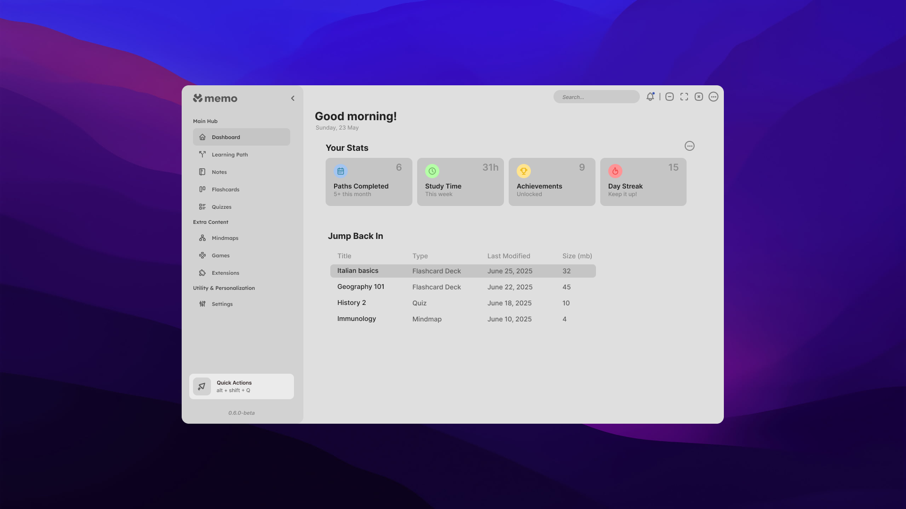
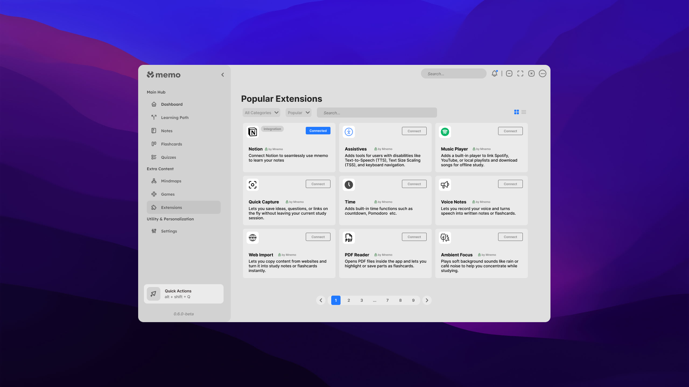
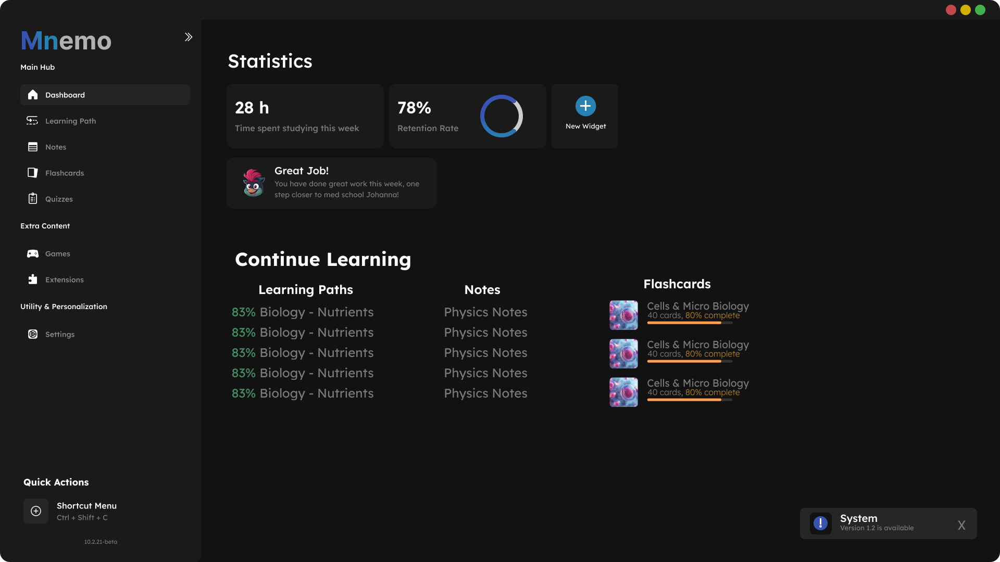
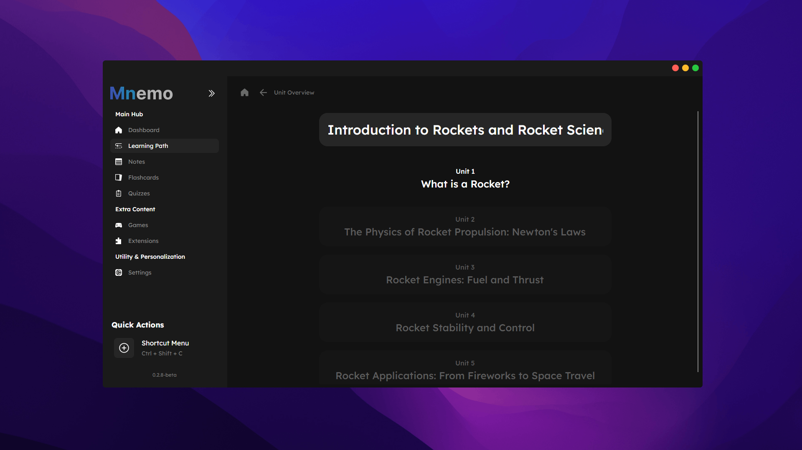
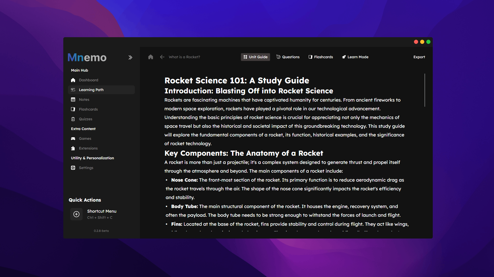
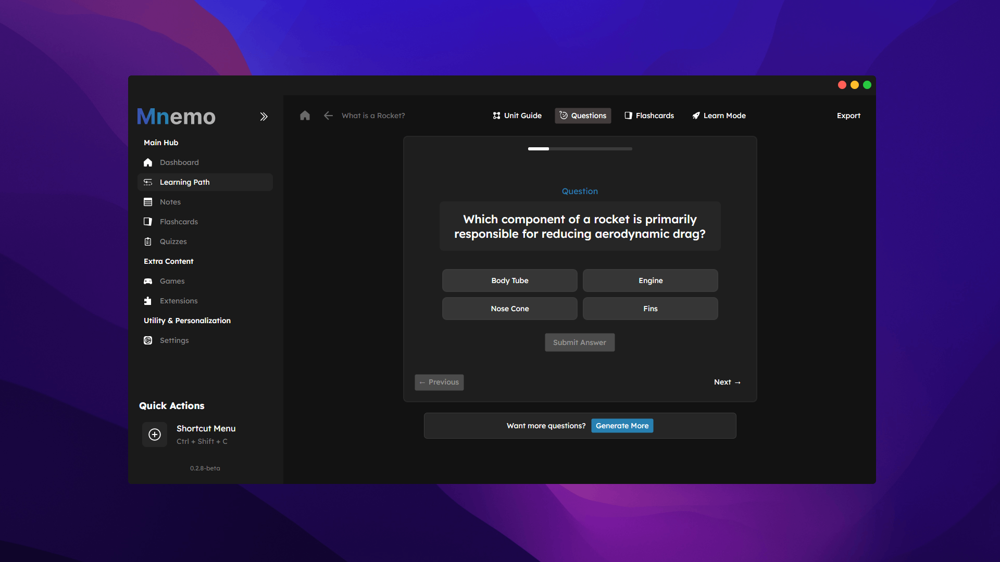
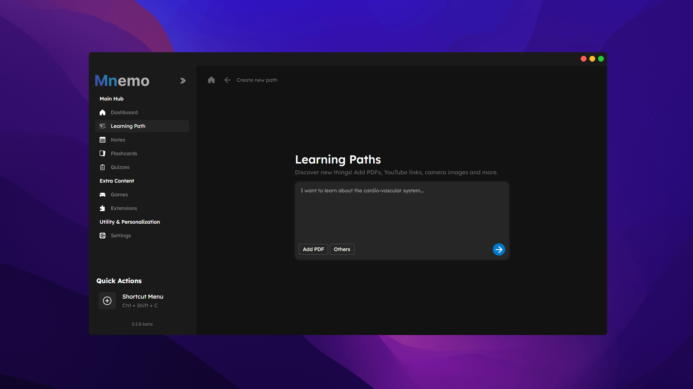
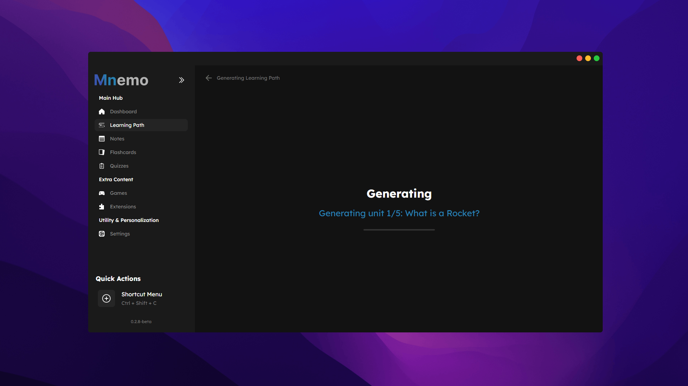
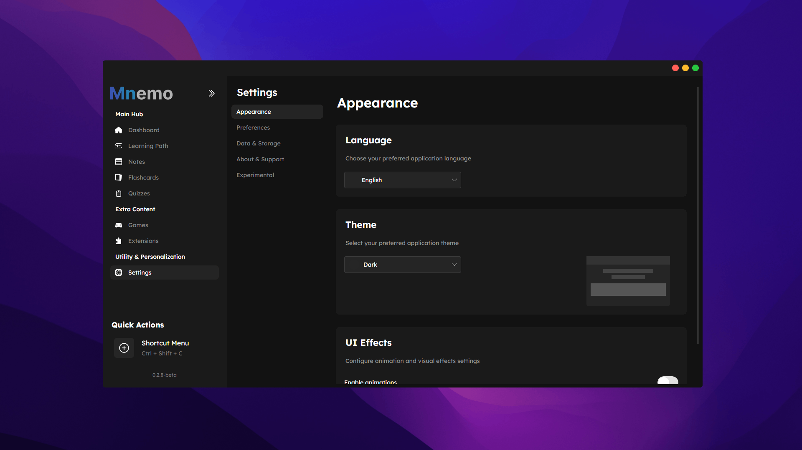

<p align="center">
    <strong>🚧 MAJOR ARCHITECTURAL REWRITE IN PROGRESS 🚧</strong><br>
    <strong>Complete ground-up rebuild with modular addon system - bringing Mnemo to v1.0!</strong><br>
    <em>Transitioning from flawed v0.4.8 foundation to privacy-first, extensible learning platform</em><br>
    <em>Current development: Complete architectural redesign → Next milestone: v1.0-alpha</em>
</p>
<p align="center">
  
  
</p>

<div align="center">
  


**A fully offline-capable, privacy-first, extensible learning and content creation platform**

[](https://opensource.org/licenses/MIT)
[](https://github.com/ShadowCCS/mnemo/releases)


</div>

## 🎯 Vision Statement

**"Mnemo exists to give people total creative and cognitive control over how they learn, remember, and express knowledge — all while respecting their data, their time, and their right to customize their tools."**

## 📚 What is Mnemo?

Mnemo is a revolutionary learning platform designed for both **end-users (learners)** and **creators/developers**. Built around the principles of privacy, extensibility, and user ownership, Mnemo serves as an all-in-one environment for creating, managing, and engaging with educational content—flashcards, mind maps, games, and interactive experiences.



| Unit Overview | Theory Section | Question Preview |
|:-------------:|:--------------:|:----------------:|
|  |  |  |

## 🔍 Core Objectives

### 🧠 Help People Learn Better
- Interactive **flashcards** with spaced repetition algorithms
- **Memory-enhancing games** built by the community
- **Visual mind maps** for knowledge exploration
- Support for **LaTeX**, **Markdown**, **emoji**, and **AI assistance**

### 🔒 Total User Ownership & Privacy
- **100% offline-capable** - all data stored locally by default
- Unique **.mnemo file format** for portable content (decks, mind maps, games)
- Optional sync support (Dropbox, etc.) that users configure themselves
- **No telemetry, no hidden dependencies, no data harvesting**

### 🧩 Modular, Extensible Ecosystem
- **Plugin/addon system** for unlimited functionality expansion
- **Mnemo API** for developers to access flashcard data, create overlays, and build games
- **Mnemo Dev IDE** - dedicated development environment with pygame integration
- Community marketplace for themes, games, tools, and language packs

### 🌍 Accessibility & Inclusion
- **TTS (Text-to-Speech)** and **STT (Speech-to-Text)** via addons
- High-contrast modes, **Lexend font** support, full keyboard navigation
- **AI-powered internationalization** with editable language files
- Accessibility features implemented as addons for modularity

### 🎮 Fun, Creative, and Visual
- Learning feels like a **game**, not a chore
- **Interactive experiences** built with embedded pygame integration
- **Mind map visualization** with custom graph engine
- Drag-and-drop layout editing and visual customization

## ✨ What Sets Mnemo Apart

- 🔓 **Open .mnemo Format**: Portable files containing flashcards, mind maps, plugins, and games
- 🧩 **Addon-First Architecture**: Even core features like accessibility are addon-driven
- 🧠 **Cognitively Designed**: Every feature supports memory, exploration, and retention
- 🛠️ **Developer-Ready**: Mnemo Dev IDE makes creating games as easy as using pygame
- 📴 **Offline-Focused**: Works without internet, sync is opt-in and user-controlled
- 🌐 **Fully Open Source**: Complete transparency, forkable, community-driven

## 🛠️ Technical Architecture

### Platform & Core
- **Desktop**: Windows/Linux/macOS using Avalonia + .NET 8.0
- **Architecture**: Modular, API-driven with secure addon sandboxing
- **Data**: Local SQLite with optional user-controlled sync
- **File Format**: .mnemo containers for all content types

### Mnemo API Features
```csharp
// Access flashcard data
mnemo.api.get.flashcard_deck_by_name("Italian Basics")

// Create UI overlays
mnemo.api.create.overlay.type1("music_overlayView")

// Utilize built-in engines
mnemo.api.lazy_loading.enable()
mnemo.api.graphs.create_mind_map()
```

### Security Model
- **Sandboxed addons** with limited internet access for specific APIs (TTS, AI, etc.)
- **Manual review process** for official marketplace addons
- **Resource management** with automatic unhooking of problematic addons
- **Clear distinction** between verified and community-sourced addons

## 📷 More Screenshots
<div align="center">
  
  
  
</div>

## 🚀 Development Status

**⚠️ Currently in Complete Architectural Redesign Phase**

After reaching v0.4.8, we discovered fundamental flaws in the original architecture that prevented true modularity and extensibility. We are now rebuilding Mnemo from the ground up with:

- **Proper modular foundation** where features can be added/removed cleanly
- **API-first design** enabling the powerful addon ecosystem
- **6th iteration UI design** focusing on usability and visual appeal
- **Developer tooling** including the dedicated Mnemo Dev IDE

### Upcoming Milestones
1. **Core Architecture** - Modular foundation with Mnemo API
2. **Basic Addon System** - Plugin loading and sandboxing
3. **Mnemo Dev IDE** - Development environment for creators
4. **v1.0-alpha** - Feature-complete preview for early adopters

## 🛠️ For Developers

### Mnemo Dev IDE (In Development)
- **Built-in pygame** integration for game development
- **Live preview** of addons and themes
- **AI-powered localization** - drag/drop language files for auto-translation
- **Visual theme editor** instead of raw YAML editing
- **API documentation** and code completion
- **API translator** for seamless version migration

### Contributing to Core Development

```bash
# Clone the repository
git clone https://github.com/ShadowCCS/mnemo.git

# Navigate to the project directory
cd mnemo

# Restore dependencies
dotnet restore

# Build the application
dotnet build

# Run the application
dotnet run
```

### Building from Source

```bash
# Build for your current platform
dotnet publish -c Release

# Build for specific platforms
dotnet publish -c Release -r win-x64 --self-contained
dotnet publish -c Release -r osx-x64 --self-contained
dotnet publish -c Release -r linux-x64 --self-contained
```

## 💡 Example Use Cases

- **Student**: Creates mind maps from lecture notes → auto-generates flashcards → practices with memory games
- **Language Learner**: Imports decks → uses TTS addon → has AI translate content to multiple languages
- **Teacher**: Builds interactive learning games with Mnemo Dev → shares as addon with students
- **Developer**: Creates accessibility themes and cognitive games → publishes to marketplace
- **Community**: Votes on features, contributes translations, builds content templates

## 🤝 Contributing

We welcome contributions to help build the future of learning technology! 

### Areas Where We Need Help
- **Core Architecture** - Modular system design and API development
- **Addon Development** - Creating the first wave of essential addons
- **UI/UX Design** - Improving the 6th iteration interface
- **Documentation** - API docs, user guides, and developer tutorials
- **Internationalization** - Translation and localization support
- **Accessibility** - Ensuring Mnemo works for everyone

### How to Contribute
1. Fork the Project
2. Create your Feature Branch (`git checkout -b feature/AmazingFeature`)
3. Commit your Changes (`git commit -m 'Add some AmazingFeature'`)
4. Push to the Branch (`git push origin feature/AmazingFeature`)
5. Open a Pull Request

## 📝 License

Distributed under the MIT License. See [LICENSE](LICENSE) for more information.

**Everything is completely open source** - the core platform, addon system, file formats, and development tools.

## 👨‍💻 Developers

- [@ShadowCCS](https://github.com/ShadowCCS) - Creator and Lead Architect

## 🙏 Acknowledgments

- [Avalonia UI](https://avaloniaui.net/) for cross-platform UI framework
- The spaced repetition and cognitive science research community
- Everyone who tested the v0.1-v0.4.8 iterations and provided feedback
- The open-source learning tools community for inspiration

---

<div align="center">
  
**Made with ❤️ for learners, creators, and developers everywhere**

*Building the future of privacy-first, extensible learning technology*

</div>
