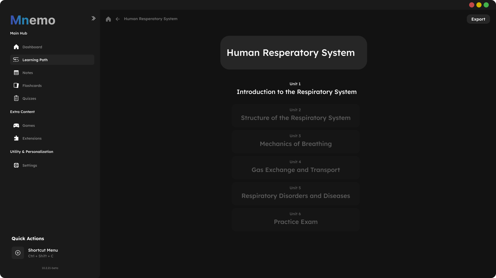
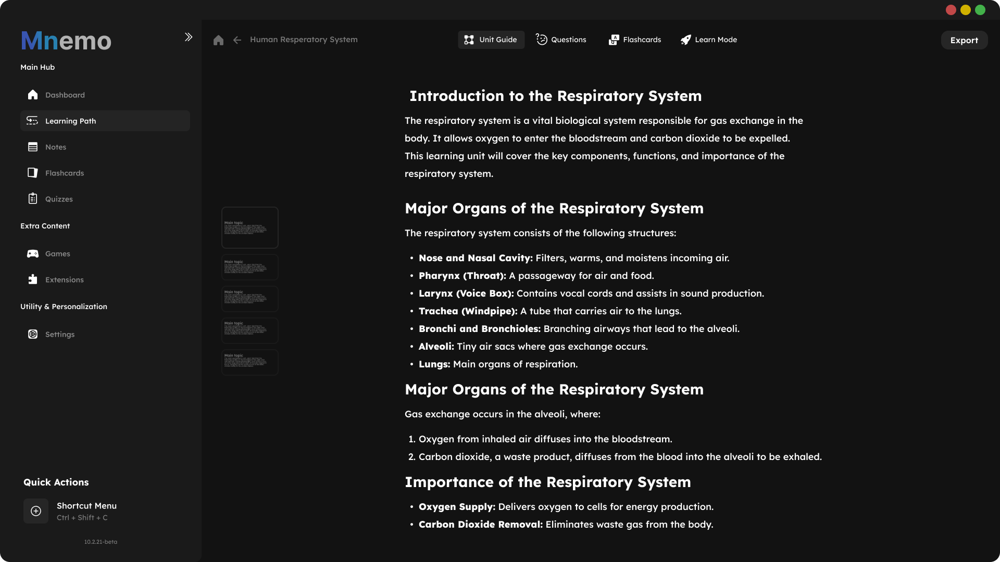

# Mnemo

<div align="center">
  


**A free and open-source study application to enhance your learning journey**

[](https://opensource.org/licenses/MIT)
[](https://github.com/ShadowCCS/mnemo/releases)


</div>

## 📚 Overview

Mnemo is a powerful, intuitive study application designed to help students, researchers, and lifelong learners optimize their educational journey. With customizable learning paths, interactive flashcards, comprehensive note-taking, and progress tracking, Mnemo provides all the tools you need to master any subject.


## ✨ Features

### 📋 Learning Paths
- Create structured learning paths for any subject
- Track your progress through learning units
- Customize your learning journey with flexible content organization

### 🗂️ Comprehensive Content Management
- **Notes**: Take and organize detailed notes for any subject
- **Flashcards**: Create interactive flashcards with spaced repetition support
- **Quizzes**: Test your knowledge with customizable quizzes

### 📊 Progress Tracking
- Monitor time spent studying
- Track retention rates across subjects
- Visualize your learning progress with intuitive statistics

### 🎮 Extra Learning Tools
- Educational games to reinforce learning
- Extensions to enhance functionality
- Personalization options to match your learning style

## 🖥️ Screenshots

<div align="center">
  
  
</div>

## 🚀 Getting Started

### Prerequisites
- [.NET 8.0 SDK](https://dotnet.microsoft.com/download/dotnet/8.0) or newer
- Dependencies:
  - Avalonia UI
  - Avalonia.Skia
  - Other Avalonia MVVM dependencies

### Installation

```bash
# Clone the repository
git clone https://github.com/ShadowCCS/mnemo.git

# Navigate to the project directory
cd mnemo

# Restore dependencies
dotnet restore

# Build the application
dotnet build

# Run the application
dotnet run
```

### Building from Source

```bash
# Build for your current platform
dotnet publish -c Release

# Build for specific platforms
dotnet publish -c Release -r win-x64 --self-contained
dotnet publish -c Release -r osx-x64 --self-contained
dotnet publish -c Release -r linux-x64 --self-contained
```

## 📋 Usage Guide

### Creating a Learning Path
1. Navigate to the Learning Path section
2. Click "New Learning Path"
3. Add units, set learning goals, and import or create content
4. Track your progress as you advance through the material

### Working with Flashcards
1. Select or create a flashcard deck
2. Add new cards with questions and answers
3. Study using the spaced repetition system
4. Review your retention statistics

### Taking Notes
1. Create a new note in the Notes section
2. Use the rich text editor for formatting
3. Link notes to specific learning paths or subjects
4. Export notes in various formats including PDF and Markdown

## 🛠️ Customization

Mnemo offers extensive customization options:

- **Themes**: Choose between light, dark, and custom themes
- **Layout**: Customize the dashboard and learning interfaces
- **Extensions**: Install community-created extensions to add functionality
- **Settings**: Fine-tune application behavior to match your workflow

## 🤝 Contributing

Contributions are what make the open-source community such an amazing place to learn, inspire, and create. Any contributions you make are **greatly appreciated**.

1. Fork the Project
2. Create your Feature Branch (`git checkout -b feature/AmazingFeature`)
3. Commit your Changes (`git commit -m 'Add some AmazingFeature'`)
4. Push to the Branch (`git push origin feature/AmazingFeature`)
5. Open a Pull Request

See [CONTRIBUTING.md](CONTRIBUTING.md) for more information.

## 🧰 Technical Stack

Mnemo is built using:
- [C#](https://docs.microsoft.com/en-us/dotnet/csharp/) - Primary programming language
- [.NET](https://dotnet.microsoft.com/) - Framework
- [Avalonia UI](https://avaloniaui.net/) - Cross-platform UI framework
- [MVVM Architecture](https://docs.microsoft.com/en-us/archive/msdn-magazine/2009/february/patterns-wpf-apps-with-the-model-view-viewmodel-design-pattern) - Design pattern
- [Avalonia.Skia](https://github.com/AvaloniaUI/Avalonia) - Graphics rendering

## 📝 License

Distributed under the MIT License. See [LICENSE](LICENSE) for more information.

## 👨‍💻 Developers

- Me - [@ShadowCCS](https://github.com/ShadowCCS)

## 🙏 Acknowledgments

- Special thanks [Avalonia UI](https://avaloniaui.net/)
- Inspired by modern learning science and spaced repetition research

---

<div align="center">
  
**[Website](https://mnemo-app.com) • [Documentation](https://docs.mnemo-app.com) • [Community Forum](https://community.mnemo-app.com) • [Report Bug](https://github.com/ShadowCCS/mnemo/issues)**

</div>
