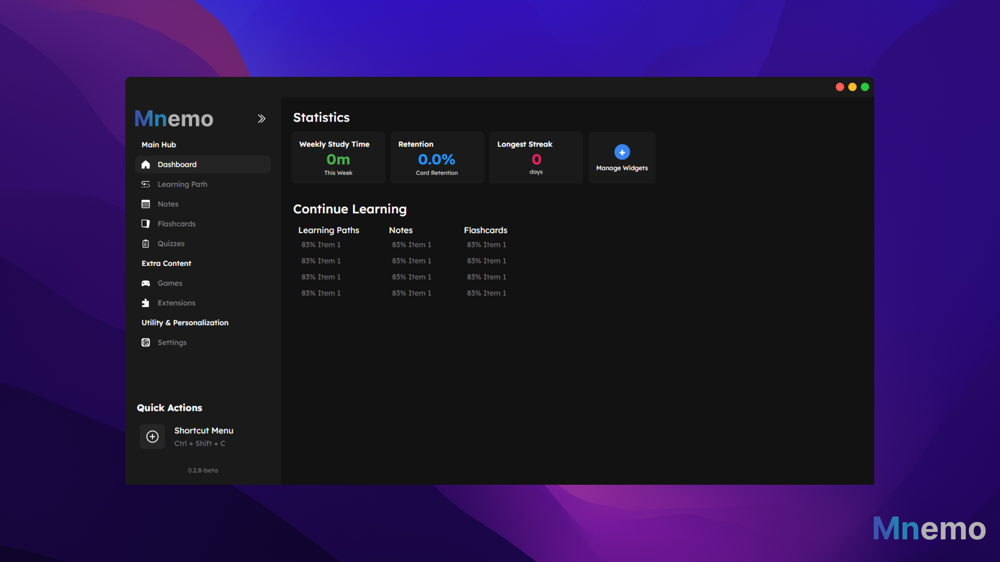

    <strong>📦 REPOSITORY RETIRED 📦</strong> 
    <strong>This repository has been archived - development continues in a new repository with a complete rewrite!</strong> 

  
  

  

  
    
  <strong>A fully offline-capable, privacy-first, extensible learning and content creation platform</strong>

## Old Images

| Unit Overview | Theory Section | Question Preview |
|:-------------:|:--------------:|:----------------:|
|  |  |  |

## 🔄 Repository Status

**This repository has been retired and archived.** The Mnemo project is being completely rebuilt from the ground up.

## 🚧 What's Next

The new Mnemo repository will be:
- **Temporary Private** - Till i have had the time to set it up.
- **Same project name** - Will be linked under here when the time comes.

## 🎯 Why the Rewrite

This repository served as valuable research and development, helping identify architectural limitations and design improvements needed for a production-ready learning platform. The insights gained here are directly informing the new, more robust implementation.

## 📝 License

I have no idea why you would want such bad code, but this archived code remains under the MIT license either way. See [LICENSE](LICENSE) for more information.

**The new iteration will also be completely open source** - core platform, addon system, file formats, and development tools.

## 👨‍💻 Development Team

- [@ShadowCCS](https://github.com/ShadowCCS) - Creator, Lead Architect and Developer
- [@Xenon] - Developer on the next iteration

## 🙏 Acknowledgments

- [Avalonia UI](https://avaloniaui.net/) for the cross-platform UI framework
- The spaced repetition and cognitive science research community
- Everyone who provided feedback and insights during this initial development phase

---

  
**Made with ❤️ for learners, creators, and developers everywhere**

